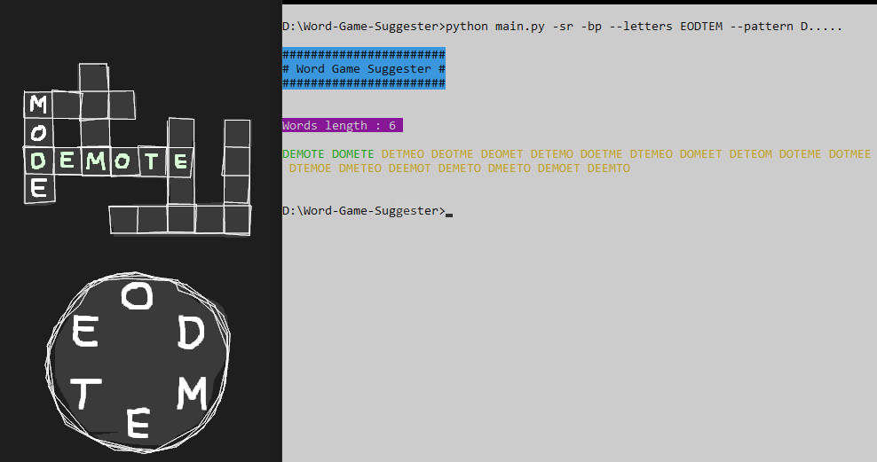
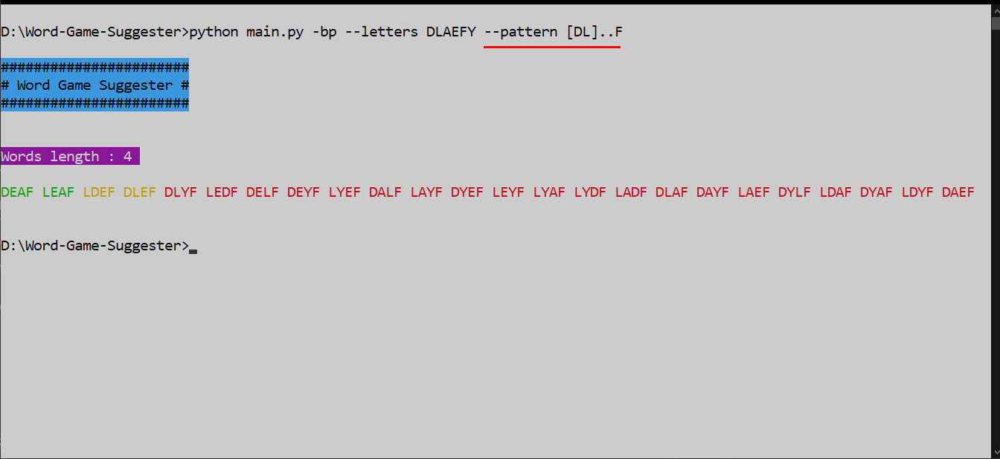

# Word Game Suggester

A very simple command line program that suggests possibilities for word games (like *wordscape*, *word cookies*, *alphabear* ..), whose objective is to find answers for a crossword given a group of letter. The algorithm is based on the *Markov chain* model and it uses the *transition matrix* from *data/* directory as the dataset.



## Running the program

Access the directory

```
cd Word-Game-Suggester
```

and run the *main.py*. Notice that there is a mandatory flag to be used (-l or --letters).

```
python main.py -l EODTEM
```

## Commands/flags

Flags which parses the commands into the program.

| command            | description |
| ------------------ | ----------- |
| -l, --letters      | All letters to be used (**required**) |
| -p, --pattern      | Regular expression which defines the pattern of all the possibilities. |
| -f, --filter       | Regular expression for not allowed patterns. |
| -bp, --bonus-point | Gives bonus point to words in the WORDLIST. |
| -sr, --skip-red    | Hides the red printed words. |
| -sy, --skip-yellow | Hides the yellow printed words. |

## Using regular expression to filter the outputs

Both flags (*--pattern* and *--filter*) use *regular expressions* to define the pattern of the outputs. For example: words with length **4**, first letter is **L** or **D** and last letter is **F**.



## Prepare data

There are already all the necessary data inside *data/* directory. Thus, you can change all those data by using the script *prepare_data.py.*

```
python prepare_date.py
```

The *data/WORDLIST.pickle* is the list of all words and *data/MCTM.pickle* is a dictionary containing the transition matrix. Notice that, as well as the main program, this script has some arguments to parse.

| command               | description |
| --------------------- | ----------- |
| -s, --samples         | Number of words randomly selected to compose the word list. |
| -ml, --minimum-length | Minimum word length (usually is 3) |
| -mo, --maximum-order  | Maximum order of previous states of the transition matrix. |